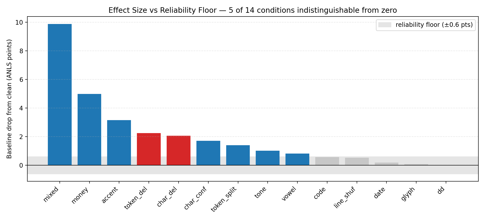
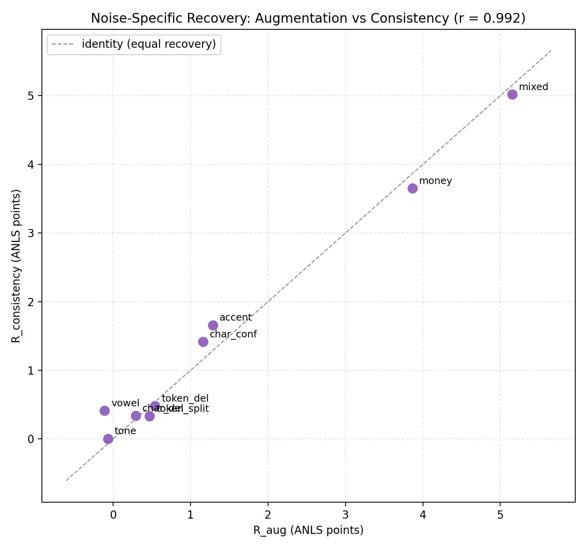
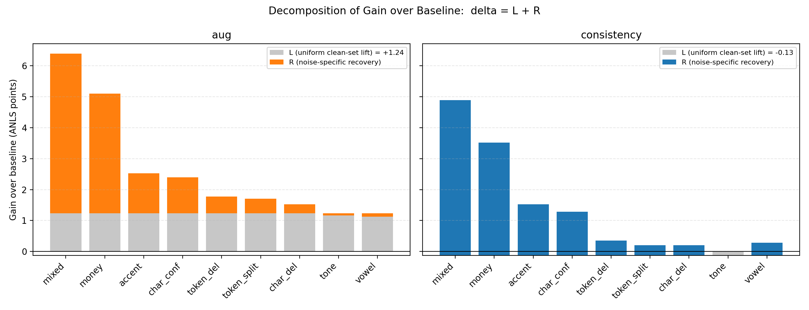
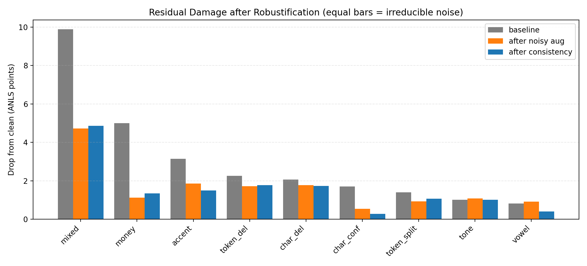
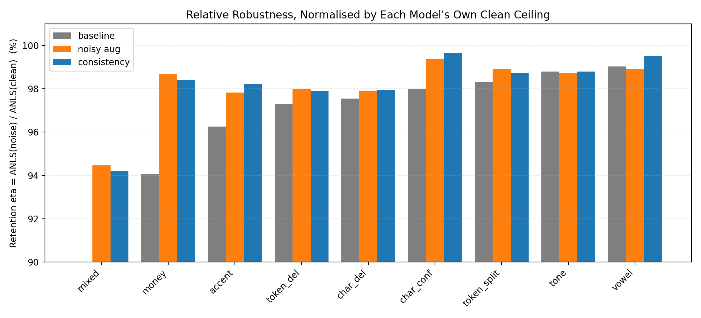

# ReceiptVQA OCR Noise Robustness — Kết Quả Thí Nghiệm

Phân tích tác động của nhiễu OCR lên ViT5 cho bài toán Vietnamese ReceiptVQA, và đánh giá 2 phương pháp tăng độ bền: **Noisy Augmentation** và **Consistency Regularization**.

## 1. Thiết Lập Thí Nghiệm

| Thành phần | Giá trị |
|-----------|---------|
| Model | VietAI/vit5-base (~223M params) |
| Dataset | ReceiptVQA (train 51,886 / dev 6,426 / test 6,500) |
| Subset ratio | 1.0 (full dataset) |
| Epochs | 3 (chọn checkpoint theo dev ANLS) |
| Learning rate | 5e-5 |
| Metric | ANLS (threshold 0.5) |
| Noise level đánh giá | L2 |
| Generation | beam=4, max_length=64 |

### 3 Flows

| Flow | Method | Training data | Loss |
|------|--------|---------------|------|
| **Flow 1** | ViT5 Clean (baseline) | Clean only | CE |
| **Flow 2** | ViT5 + Noisy Aug | Clean + Noisy (2×) | CE |
| **Flow 3** | ViT5 + Consistency | Paired clean/noisy | CE_clean + CE_noisy + 0.5·Consistency |

### Phân bố answer (test set)


- **~49% answer là số/số điện thoại**, ~45% là text, phần còn lại là money/date có đơn vị rõ ràng.
- Nhiều số tiền không kèm "đ/VND" nên rơi vào nhóm number. Thực tế **gần một nửa answer chứa chữ số** → cực nhạy với `character_confusion` (0↔O, 1↔l, 5↔S) và `money_noise`.
- Answer ngắn (đa số < 15 ký tự) → chỉ vài ký tự sai đã đủ kéo similarity xuống dưới ngưỡng ANLS 0.5. Đây là gốc rễ của "cliff effect".

## 2. Kết Quả Tổng Hợp (ANLS @ L2)


| Condition | Noise Type | Flow1 Clean | Flow2 Aug | Flow3 Consist |
|-----------|-----------|:-----------:|:---------:|:-------------:|
| clean | — | 0.8411 | **0.8534** | 0.8397 |
| N20 | mixed_noise | 0.7422 | **0.8062** | 0.7911 |
| N16 | money_noise | 0.7911 | **0.8421** | 0.8263 |
| N1 | accent_removal | 0.8096 | **0.8348** | 0.8248 |
| N10 | token_deletion | 0.8185 | **0.8363** | 0.8220 |
| N7 | character_deletion | 0.8204 | **0.8357** | 0.8225 |
| N5 | character_confusion | 0.8240 | **0.8480** | 0.8369 |
| N14 | token_split | 0.8270 | **0.8441** | 0.8290 |
| N2 | tone_confusion | 0.8309 | **0.8425** | 0.8296 |
| N3 | vowel_diacritic_confusion | 0.8329 | **0.8442** | 0.8357 |
| N18 | code_noise | 0.8353 | **0.8507** | 0.8370 |
| N13 | line_shuffle | 0.8359 | **0.8492** | 0.8351 |
| N17 | date_noise | 0.8392 | **0.8536** | 0.8396 |
| N6 | glyph_confusion | 0.8403 | **0.8526** | 0.8389 |
| N4 | dd_confusion | 0.8413 | **0.8519** | 0.8397 |

## 3. Phân Tích Noise Impact


### Ranking mức độ ảnh hưởng (drop from clean, baseline model)

| Rank | Noise Type | Drop | Mức độ |
|:----:|-----------|:----:|--------|
| 1 | **mixed_noise** | −9.88 | 🔴 Nghiêm trọng |
| 2 | **money_noise** | −4.99 | 🔴 Nghiêm trọng |
| 3 | accent_removal | −3.15 | 🟠 Trung bình |
| 4 | token_deletion | −2.26 | 🟠 Trung bình |
| 5 | character_deletion | −2.07 | 🟠 Trung bình |
| 6 | character_confusion | −1.70 | 🟡 Nhẹ |
| 7 | token_split | −1.40 | 🟡 Nhẹ |
| 8 | tone_confusion | −1.02 | 🟡 Nhẹ |
| 9–14 | vowel/code/line/date/glyph/dd | < −1.0 | ⚪ Dưới ngưỡng tin cậy |

### Nhận xét chính

1. **Money noise là thủ phạm đơn lẻ lớn nhất (−4.99).** Đặc thù ReceiptVQA: answer thường là số tiền; sai 1 chữ số → sai hoàn toàn (dưới ngưỡng ANLS 0.5).

2. **Mixed noise nặng nhất (−9.88)** vì kết hợp nhiều lỗi cùng lúc.

3. **Deletion > Confusion.** token_deletion (−2.26) và character_deletion (−2.07) hại hơn các loại confusion. Mất thông tin nặng hơn nhiễu thông tin.

4. **Accent removal (−3.15)** đáng chú ý — đặc thù tiếng Việt, bỏ dấu làm đổi nghĩa từ.

5. **6/14 điều kiện nằm dưới ngưỡng tin cậy — lưới nhiễu hữu hiệu chỉ ~7 chiều.** vowel, code, line_shuffle, date, glyph, dd đều có |effect| < 0.6 điểm **và đổi dấu giữa các model** (dd: −0.02 ở baseline nhưng +0.002 ở consistency). Ở một seed, chúng không phân biệt được với zero. Hệ quả: mọi so sánh trên 6 điều kiện này đều không kết luận được, và ngân sách augmentation rải lên chúng là lãng phí.



### 3.1 Tại sao money_noise hại 27× hơn date_noise (cùng probability param 0.30)?

`money_noise` và `date_noise` được cấu hình cùng xác suất áp dụng (0.30 tại L2 trong `noise.py`), nhưng drop chênh nhau **27×** (−4.99 vs −0.19). Giả thuyết: probability tham số không quyết định impact — mà là **tỷ lệ answer thực sự chứa loại thông tin đó**.

Đo trực tiếp trên test set (6,500 answers):

| Field type | % answer khớp pattern | Drop tương ứng | Drop / % exposure |
|-----------|:---------------------:|:--------------:|:------------------:|
| money/number | 48.75% | −4.99 | 0.102 |
| date | 5.22% | −0.19 | 0.036 |
| accent (toàn văn) | 100% | −3.15 | 0.032 |
| character (toàn văn, weighted) | 73.83% (answer có digit) | −1.70 | 0.023 |

**Kết luận:**
- Exposure (tỷ lệ answer chứa field bị nhiễu) giải thích phần lớn khoảng cách 27×: money chạm ~49% answer, date chỉ ~5% — chênh lệch **~9.3×** về exposure.
- Nhưng ngay cả sau khi chuẩn hoá theo exposure, **money vẫn hại hơn date** (0.102 vs 0.036 — còn chênh ~2.8×). Lý do: money field vừa mất separator (`.`/`,`) vừa đổi ký tự số cùng lúc, và answer dạng số **không có "gần đúng"** — sai 1 chữ số là sai giá trị hoàn toàn, trong khi date sai 1 ký tự (ví dụ `2024`→`2O24`) đôi khi vẫn giữ được đủ ngữ cảnh để human-readable dù máy đọc sai.
- Correlation thô giữa noise-probability-parameter và drop trên toàn bộ 13 loại (không tính mixed) chỉ **r=0.36** — xác nhận probability param KHÔNG phải yếu tố dự đoán chính; exposure (tần suất answer chạm field) mới là yếu tố chi phối.

*(Exposure đo trên answer text bằng regex, dùng như proxy — không đo trực tiếp trên OCR context vì không có ground-truth span annotation.)*

## 4. So Sánh 2 Phương Pháp


So sánh trực tiếp bằng `drop_from_clean` bị **confound**: mỗi model đo drop so với trần clean của **chính nó**, nên cột thấp hơn không đồng nghĩa robust hơn. Mục này tách hiệu ứng thành hai thành phần để khử confound.

### 4.1 Phân rã hiệu ứng

Gọi $A_m(n)$ là ANLS của model $m$ trên điều kiện $n$; $n_0$ là clean; $B$ là baseline.

| Đại lượng | Công thức | Ý nghĩa |
|---|---|---|
| $L_m$ | $A_m(n_0) - A_B(n_0)$ | **Nâng nền chung** — dịch chuyển năng lực tổng quát hóa, không phụ thuộc nhiễu |
| $\Delta_m(n)$ | $A_m(n) - A_B(n)$ | Lợi ích tuyệt đối so baseline |
| $R_m(n)$ | $\Delta_m(n) - L_m = \text{drop}_B(n) - \text{drop}_m(n)$ | **Khử nhiễu riêng** — phần chỉ thuộc loại nhiễu đó |
| $\rho_m(n)$ | $1 - \text{drop}_m(n)/\text{drop}_B(n)$ | Hệ số khả quy — tỷ lệ thiệt hại được sửa |
| $\eta_m(n)$ | $A_m(n)/A_m(n_0)$ | Retention — robust tương đối, chuẩn hóa theo trần riêng |

Giả định mô hình hóa: **additive separability**, $\Delta_m(n) \approx L_m + R_m(n)$.
Đo được **$L_{aug} = +1.23$**, **$L_{cons} = -0.14$** điểm → chênh nền $\Delta L = 1.37$.

### 4.2 Khử nhiễu riêng của hai phương pháp gần bằng nhau




| Noise | $\Delta_{aug}$ | $\Delta_{cons}$ | $R_{aug}$ | $R_{cons}$ |
|---|:---:|:---:|:---:|:---:|
| mixed | +6.39 | +4.89 | 5.16 | 5.02 |
| money | +5.10 | +3.52 | 3.87 | 3.65 |
| accent | +2.52 | +1.53 | 1.29 | **1.66** |
| char_conf | +2.39 | +1.29 | 1.16 | **1.42** |
| token_del | +1.78 | +0.35 | 0.54 | 0.48 |
| char_del | +1.53 | +0.21 | 0.29 | **0.34** |
| token_split | +1.71 | +0.20 | 0.47 | 0.33 |
| **Trung bình (7 điều kiện có tín hiệu)** | | | **1.82** | **1.84** |

Cột $\Delta$ tái hiện kết luận cũ "Aug thắng ở mọi loại". Nhưng sau khi trừ nền, **$R$ của hai phương pháp nằm sát đường chéo** — trung bình 1.82 vs 1.84, và trên accent / char_conf / char_del thì Consistency còn khử **mạnh hơn**.

**Kết luận:** ưu thế tổng hợp của Aug quy gần như hoàn toàn về $\Delta L = 1.37$ — tức phần *regularization tổng quát*, **không phải** phần *chống nhiễu*. Kiểm tra nội tại: ở các nhiễu vô hại (glyph, dd), $\Delta_{aug} \approx L_{aug}$ và $R \approx 0$, nhất quán với giả định nền truyền đều.

### 4.3 Nhiễu xóa là bất khả quy



| Noise | drop baseline | drop sau Aug | $\rho_{aug}$ |
|---|:---:|:---:|:---:|
| money | 4.99 | 1.13 | **0.77** |
| char_conf | 1.70 | 0.55 | 0.68 |
| accent | 3.15 | 1.86 | 0.41 |
| token_del | 2.26 | 1.71 | **0.24** |
| char_del | 2.07 | 1.78 | **0.14** |

Nhiễu thay thế **reducible** — tồn tại ánh xạ chuẩn hóa xác định (`O`↔`0`) để học. Nhiễu xóa **irreducible** — bằng chứng bị loại khỏi đầu vào nên không objective augmentation nào phục hồi được.

Đây là tinh chỉnh cho nhận xét 3 ở mục 3: deletion không chỉ *hại hơn* confusion, mà còn **không chữa được**. Sau robust hóa, vulnerability trội **chuyển từ money sang deletion**.

### 4.4 Kiểm định chéo bằng retention



Chuẩn hóa theo trần riêng loại bỏ ảnh hưởng của $L_m$. Trên money: $\eta_{cons} = 0.984 \approx \eta_{aug} = 0.987 \gg \eta_B = 0.941$ — hai phương pháp hội tụ, xác nhận độc lập cho 4.2.

## 5. Vì Sao Consistency Mất Nền Clean?

Mục 4.2 định vị lại điểm yếu: Consistency **không** kém ở khử nhiễu, mà mất nền clean.

| | Noisy Aug | Consistency |
|---|-----------|-------------|
| Dataset | 103,772 samples (shuffle) | 51,886 pairs |
| Loss | CE | CE_clean + CE_noisy + 0.5·(1−cos) |
| Clean ANLS | **0.8534** | 0.8397 |
| $L_m$ (nâng nền) | **+1.23** | **−0.14** |
| $\bar R$ (khử nhiễu riêng) | 1.82 | **1.84** |

Hai phương pháp khử nhiễu ngang nhau; toàn bộ khoảng cách nằm ở cột $L_m$.

**Cơ chế (giả thuyết):** loss `1 − cos` chỉ tối ưu *alignment* mà **không có số hạng đẩy** (*uniformity*). Nghiệm tầm thường của nó là ánh xạ mọi biểu diễn về cùng một vùng không gian — **representation collapse** — làm mất phương sai biểu diễn mà hiệu năng trên phân phối sạch phụ thuộc vào (khung alignment–uniformity, Wang & Isola, ICML 2020).

Bottleneck mean-pool (256 token → 1 vector 768 chiều) làm tín hiệu thêm thô, nhưng riêng nó **không** giải thích được việc *mất* điểm clean; thiếu số hạng đẩy mới là nguyên nhân đủ.

**Hệ quả:** đây là vấn đề của **dạng hàm mục tiêu**, không phải của ý tưởng consistency. Thay bằng InfoNCE (thêm negative trong batch) hoặc symmetric-KL trên phân phối decoder (R-Drop) thì collapse trở thành nghiệm có loss cao, về nguyên tắc giữ được nền clean. Thiết kế và giao thức đánh giá đề xuất: `CONSISTENCY_V2_DESIGN.md` (**chưa tích hợp vào code** — bản hiện tại vẫn dùng cosine).

## 6. Kết Luận Và Đề Xuất Cải Tiến

1. **Không phải noise nào cũng hại** — chỉ 7/14 điều kiện mang tín hiệu, trong đó 3 loại nghiêm trọng (mixed, money, accent).
2. **Money noise critical** cho ReceiptVQA — exposure ~49% answer chứa chữ số.
3. **Noisy Augmentation là lựa chọn tốt nhất hiện tại**, nhưng lợi thế của nó chủ yếu đến từ hiệu ứng regularization tổng quát ($L = +1.23$), **không phải** từ khả năng chống nhiễu vượt trội.
4. **Consistency là phương pháp robust hợp lệ** ($\bar R$ 1.84 vs 1.82 của Aug); dạng loss hiện tại mới là thứ làm mất nền clean — một vấn đề *hàm mục tiêu* có thể sửa.
5. **Nhiễu xóa là ranh giới cứng** — không augmentation nào vượt được $\rho \approx 0.2$.

Các đề xuất dưới đây xếp theo tỷ lệ lợi ích/chi phí, mỗi mục neo vào một quan sát cụ thể ở trên.

### 6.1 Sửa dạng consistency loss (ưu tiên cao nhất)

Từ mục 5: điểm yếu duy nhất là mất nền clean do collapse. Hai biến thể thay thế, chi phí chỉ là đổi một hàm loss — **InfoNCE** (thêm negative) và **symmetric-KL / R-Drop** (align phân phối decoder, bỏ qua bottleneck mean-pool). Đề xuất bổ sung tham số `consistency_type ∈ {cosine, contrastive, kl}`; thiết kế chi tiết trong `CONSISTENCY_V2_DESIGN.md` (**chưa tích hợp vào code**).

**Phép kiểm quyết định:** clean ANLS của biến thể mới ≥ 0.8411 trong khi cosine vẫn ~0.8397.

### 6.2 Phân bổ lại ngân sách augmentation

`random.choice` hiện rải **đều 1/14**, trong khi mục 3 cho thấy 6 loại nằm dưới ngưỡng tin cậy và thiệt hại tập trung ở 3 loại. Đề xuất lấy mẫu theo trọng số tỷ lệ với drop đo được. Chi phí bằng 0.

### 6.3 Bổ sung nhầm lẫn chữ số ↔ chữ số

`char_map` hiện **toàn bộ là digit↔letter** (`0↔O`, `5↔S`), không có cặp digit↔digit (`3↔8`, `6↔8`, `1↔7`) — trong khi ~49% answer chứa chữ số và mục 4.3 cho thấy nhiễu thay thế là loại **khử được tốt nhất** ($\rho$ 0.68–0.77). Đây là lỗ hổng bao phủ lớn nhất của bộ sinh nhiễu.

### 6.4 Augmentation neo theo answer

Nhiễu hiện **mù answer**: rải đều lên context, chỉ *tình cờ* trúng vùng quyết định — mâu thuẫn với kết luận exposure ở mục 3.1. Đề xuất định vị chuỗi answer rồi chủ động áp nhiễu lên chính vùng đó, biến việc học bất biến thành curriculum có giám sát.

*Điều kiện tiên quyết:* đo tỷ lệ answer là extractive (cột `eligible` trong `scripts/analyze_noise_distribution.py`); nếu phần lớn abstractive thì không định vị được.

### 6.5 Consistency dư thừa cho nhiễu xóa

Mục 4.3 cho thấy augmentation bất lực với deletion. Về lý thuyết thông tin, cách duy nhất phục hồi thông tin đã mất là **dư thừa** — hóa đơn lặp giá trị (tổng tiền ở subtotal/tổng cộng/thành tiền). Đề xuất: xóa một bản sao, thêm loss buộc model trả lời đúng nhờ bản còn lại.

*Điều kiện tiên quyết:* đo tần suất answer xuất hiện >1 lần trong context.

### 6.6 Phân phối nhiễu thích ứng theo lỗi

Tương quan giữa tham số xác suất thiết kế và thiệt hại thực tế chỉ **r = 0.36** (mục 3.1), nên gán trọng số bằng tay cũng chỉ là đoán tốt hơn. Đề xuất: sau mỗi epoch, tìm cặp (mẫu, loại nhiễu) bị sai và oversample, để chính lỗi của model định nghĩa phân phối.

### 6.7 Ưu tiên thực thi

| Đề xuất | Lợi ích kỳ vọng | Chi phí | Rủi ro giả định |
|---|---|---|---|
| 6.1 contrastive/KL | Cao — sửa đúng điểm yếu đo được | Thấp | Thấp |
| 6.2 trọng số nhiễu | Trung bình–cao | ~0 | Thấp |
| 6.3 digit↔digit | Trung bình–cao | Thấp | Thấp |
| 6.4 neo answer | Cao | Trung bình | Cần answer extractive |
| 6.5 dư thừa | Cao cho deletion | Cao | Cần đo dư thừa |
| 6.6 thích ứng | Trung bình | Trung bình | Thấp |

## 7. Noise Taxonomy (14 loại)

Tất cả noise sinh bởi `OCRNoiseGenerator` (seed=42). Cường độ scale theo level: L1=0.5×, L2=1.0×, L3=1.6×. Ví dụ dưới đây ở L2/L3 để minh hoạ rõ.

| ID | Noise Type | Mô tả | Clean → Noisy (ví dụ) |
|----|-----------|-------|------------------------|
| N1 | accent_removal | Bỏ toàn bộ dấu tiếng Việt + đ→d | `Tổng cộng: 1.250.000đ` → `Tong cong: 1.250.000d` |
| N2 | tone_confusion | Đổi dấu thanh (sắc/huyền/hỏi/ngã/nặng) | `Số HĐ ...` → `Sổ HĐ ...` |
| N3 | vowel_diacritic_confusion | Nhầm dấu nguyên âm (a/ă/â, o/ô/ơ...) | `Tổng cộng` → `Tổng cơng` |
| N4 | dd_confusion | đ/Đ → d/D | `Đặt hàng đơn giá` → `Dặt hàng đơn giá` |
| N5 | character_confusion | Nhầm ký tự nhìn giống: 0↔O, 1↔l, 5↔S, 8↔B, 2↔Z | `HD00123` → `HD001Z3` |
| N6 | glyph_confusion | Nhầm cụm glyph: rn↔m, cl↔d, vv↔w | `burn` → `bum` |
| N7 | character_deletion | Xoá ngẫu nhiên ký tự (giữ khoảng trắng) | `1.250.000đ` → `1.250.00đ` |
| N10 | token_deletion | Xoá/chèn token ngẫu nhiên | `Số HĐ: ABC...` → `HĐ: ABC...` |
| N13 | line_shuffle | Xáo trộn thứ tự dòng/câu | `Mua hang. Thanh toan. Cam on` → `Cam on Thanh toan Mua hang` |
| N14 | token_split | Tách 1 token dài thành 2 | `cộng:` → `cộ ng:` |
| N16 | money_noise | Phá số tiền: bỏ dấu phân cách + nhầm ký tự số | `1.250.000đ` → `1 25O OOO d` |
| N17 | date_noise | Phá ngày tháng (dd/mm/yyyy) | `15/03/2024` → `15/03/ZOZ4` |
| N18 | code_noise | Phá mã (chuỗi A-Z0-9 ≥5): nhầm + xoá ký tự | `ABCDE12345` → `ABCD1Z35` |
| N20 | mixed_noise | Kết hợp ngẫu nhiên nhiều loại trên | `Tổng cộng: 1.250.000đ` → `Tong cong: 1.250.000d ---` |

## 8. Qualitative Analysis

**Tại sao money_noise & mixed_noise hại nhất:**

- **money_noise**: Answer của ReceiptVQA thường là số tiền. Khi `1.250.000đ` → `1 25O OOO d`, model đọc sai chữ số (`0`→`O`) và mất dấu phân cách. Answer số sai 1 ký tự → similarity tụt dưới ngưỡng ANLS 0.5 → tính là **sai hoàn toàn** (score 0). Đây là hiệu ứng "cliff": lỗi nhỏ ở answer quan trọng → mất trắng điểm.

- **mixed_noise**: Chồng nhiều lỗi (bỏ dấu + nhầm ký tự + phá số + xoá token). Context bị nhiễu ở nhiều mặt cùng lúc → model khó bám tín hiệu → drop lớn nhất (−9.88).

**Tại sao glyph/dd/date/tone gần như vô hại:**

- Các lỗi này (i) hiếm khi rơi trúng answer, hoặc (ii) ViT5 đã học được biến thể chính tả tương tự trong pretraining tiếng Việt. `date_noise` chỉ hại nếu câu hỏi hỏi về ngày — phần lớn câu hỏi hỏi về tiền/tên hàng nên ít ảnh hưởng.

**Cơ chế cứu của Noisy Aug:** Khi thấy `O`/`0`, `l`/`1` lẫn lộn trong lúc train, model học coi chúng tương đương → đọc đúng số tiền dù bị nhiễu. Đây là lý do aug cứu money noise nhiều nhất (+5.1).

## 9. Limitations

- **Một seed, một model.** Chưa chạy multi-seed để ước lượng phương sai. Theo mục 3, 6/14 điều kiện nằm dưới ngưỡng tin cậy và đổi dấu giữa các model. Các phát hiện ở mục 4 có effect size 1–5 điểm nên đủ tin, nhưng trước khi công bố cần **multi-seed / paired bootstrap** để có khoảng tin cậy.
- **Chưa kiểm định tính cộng dồn của `mixed_noise`.** Nó dùng xác suất nội bộ thấp hơn các điều kiện đứng riêng, nên so trực tiếp drop của mixed với tổng drop thành phần sẽ sai. Cần thí nghiệm khớp xác suất.
- **Giả định additive separability** ($\Delta = L + R$ ở mục 4.1) chưa được kiểm định hình thức; mới chỉ có bằng chứng nhất quán ở các điều kiện $R \approx 0$.
- **Noise tổng hợp.** Nhiễu sinh bằng luật, không phải OCR error thực tế từ ảnh receipt. Phân phối lỗi thật có thể khác.
- **Chỉ ViT5-base.** Chưa so sánh với model khác (mBART, layout-aware như LiGT) để biết finding có tổng quát không.
- **Level cố định L2 khi so sánh chính.** Chưa quét L1/L3 đầy đủ để xác nhận severity scaling monotonic.
- **Adapter/RON-NACA chưa chạy** — phạm vi báo cáo giới hạn ở clean vs augmentation vs consistency.

## 10. Compute Cost

| Flow | Method | Trainable params | Train time (epoch) | Ghi chú |
|------|--------|:----------------:|:------------------:|---------|
| 1 | Clean baseline | 225M | ~15 phút | full fine-tune |
| 2 | Noisy Aug | 225M | ~30 phút | 2× data |
| 3 | Consistency | 225M | ~90 phút | paired forward, batch=4 |

Consistency đắt nhất (2 forward passes/step + batch nhỏ). Với dạng loss hiện tại, chi phí này không tương xứng lợi ích; nhưng theo mục 4.2 phần khử nhiễu của nó ngang Aug, nên đánh giá lại sau khi thử biến thể ở mục 6.1 mới là kết luận công bằng.

## 11. Training Dynamics


Dev ANLS theo từng epoch (dev-based checkpoint selection):

| Epoch | Baseline | Consistency |
|:-----:|:--------:|:-----------:|
| 1 | 0.7842 | 0.7868 |
| 2 | 0.8140 | 0.8110 |
| 3 | **0.8291** | **0.8310** |

Train loss (baseline): 0.6435 → 0.4084 → 0.3286.

**Nhận xét:**
- Cả 2 flows **converge đơn điệu**, dev ANLS tăng đều qua 3 epochs → chưa overfit, chọn epoch cuối là hợp lý.
- Consistency đuổi kịp baseline ở dev (0.8310 vs 0.8291) nhưng **kém ở clean test** (0.8397 vs 0.8411) — cho thấy consistency generalize sang phân phối test hơi kém hơn dù dev ANLS nhỉnh.
- Baseline chưa bão hoà loss ở epoch 3 (0.33) → có thể train thêm epoch, nhưng gain kỳ vọng nhỏ.

*(noisy_aug per-epoch dev ANLS không được lưu trong log → không đưa vào biểu đồ để tránh số liệu bịa.)*

## 12. Files

```
outputs/results/
├── flow1_vit_clean_noise_l2.csv        Baseline (14 noise types @ L2)
├── flow2_vit_aug_noise_l2.csv          Noisy Aug
├── flow3_consistency_noise_l2.csv      Consistency
├── flow{1,2,3}_*_anls.png              ANLS bar charts (từng flow)
├── flow{1,2,3}_*_drop.png              Drop-from-clean charts (từng flow)
├── combined_3flows_l2_anls.png         So sánh 3 flows (ANLS)
├── combined_3flows_l2_drop.png         So sánh 3 flows (drop from clean)
├── training_curves_dev_anls.png        Dev ANLS per epoch
├── training_curves_train_loss.png      Train loss per epoch
├── fig_answer_distribution.png         Phân bố answer type + độ dài
├── fig_noise_drop_ranking.png          Ranking noise impact
├── fig_recovery.png                    Recovery 2 methods per noise
├── fig_method_summary.png              Tổng kết clean vs noisy
│
│   # Phân rã hiệu ứng (mục 3, 4)
├── relationship_metrics.csv            L, delta, R, rho, eta cho từng điều kiện
├── fig_noise_floor.png                 Effect size vs ngưỡng tin cậy (mục 3)
├── fig_recovery_equivalence.png        R_aug vs R_consistency (mục 4.2)
├── fig_lift_decomposition.png          delta = L + R, dạng stacked (mục 4.2)
├── fig_reducibility.png                Drop trước/sau robust hóa (mục 4.3)
└── fig_retention.png                   Retention eta theo model (mục 4.4)
```

**Sinh lại toàn bộ figures + bảng số liệu bằng một lệnh:**

```bash
python scripts/plot_report_figures.py
```

Lệnh này tạo cả 9 figure, xuất `relationship_metrics.csv`, và in ra bảng tóm tắt
$L$ / $R$ / $\rho$ kèm correlation — dùng để đối chiếu với các con số trong mục 4.
Tùy chọn `--floor` đổi ngưỡng tin cậy (mặc định 0.006 = 0.6 điểm).

Yêu cầu: 3 file `flow*_noise_l2.csv` phải có sẵn (sinh bởi `eval_noise_grid.py`).

*(`scripts/analyze_relationships.py` vẫn chạy được nhưng đã deprecated — nó chỉ là
wrapper gọi lại phần phân rã trong `plot_report_figures.py`.)*

