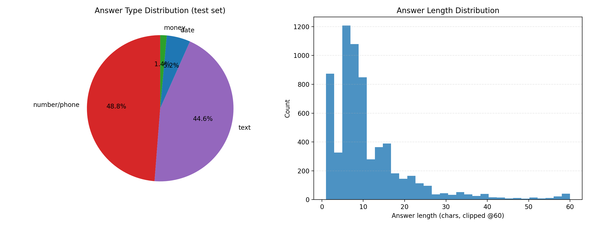
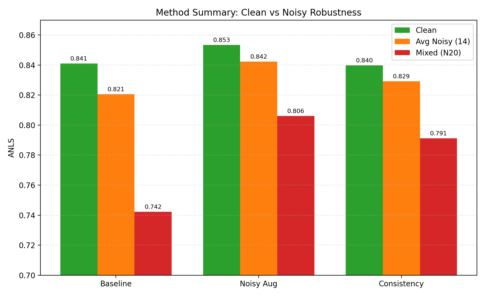
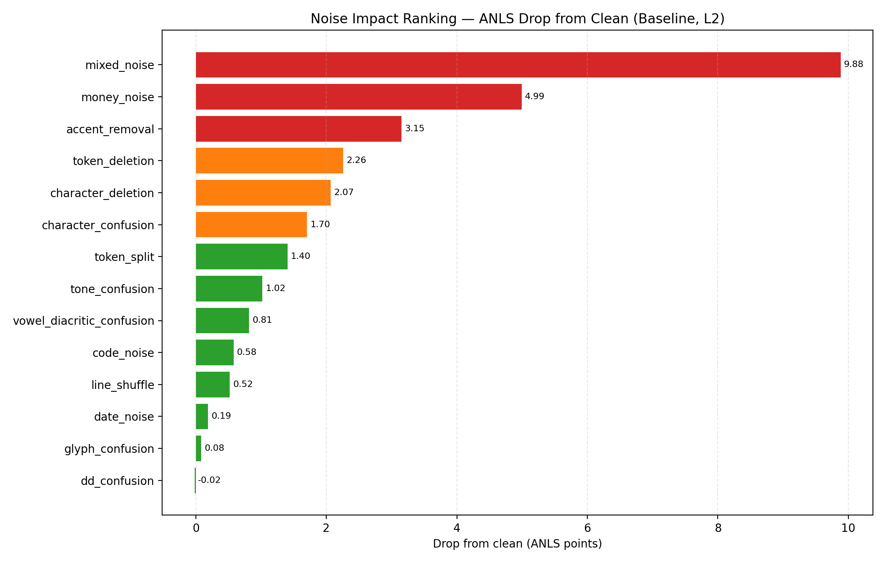
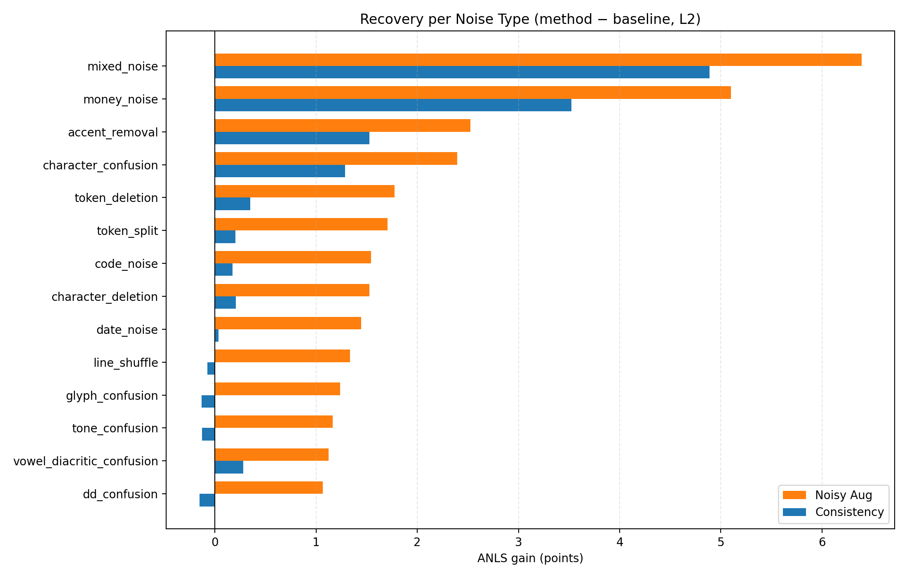
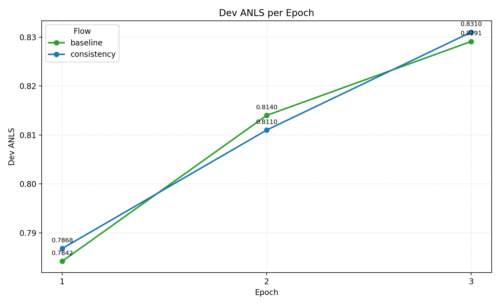

# ReceiptVQA OCR Noise Robustness — Kết Quả Thí Nghiệm

Phân tích tác động của nhiễu OCR lên ViT5 cho bài toán Vietnamese ReceiptVQA, và đánh giá 2 phương pháp tăng độ bền: **Noisy Augmentation** và **Consistency Regularization**.

## 1. Thiết Lập Thí Nghiệm

| Thành phần | Giá trị |
|-----------|---------|
| Model | VietAI/vit5-base (~223M params) |
| Dataset | ReceiptVQA (train 51,886 / dev 6,426 / test 6,500) |
| Subset ratio | 1.0 (full dataset) |
| Epochs | 3 (chọn checkpoint theo dev ANLS) |
| Learning rate | 5e-5 |
| Metric | ANLS (threshold 0.5) |
| Noise level đánh giá | L2 |
| Generation | beam=4, max_length=64 |

### 3 Flows

| Flow | Method | Training data | Loss |
|------|--------|---------------|------|
| **Flow 1** | ViT5 Clean (baseline) | Clean only | CE |
| **Flow 2** | ViT5 + Noisy Aug | Clean + Noisy (2×) | CE |
| **Flow 3** | ViT5 + Consistency | Paired clean/noisy | CE_clean + CE_noisy + 0.5·Consistency |

### Phân bố answer (test set)



- **~49% answer là số/số điện thoại**, ~45% là text, phần còn lại là money/date có đơn vị rõ ràng.
- Nhiều số tiền không kèm "đ/VND" nên rơi vào nhóm number. Thực tế **gần một nửa answer chứa chữ số** → cực nhạy với `character_confusion` (0↔O, 1↔l, 5↔S) và `money_noise`.
- Answer ngắn (đa số < 15 ký tự) → chỉ vài ký tự sai đã đủ kéo similarity xuống dưới ngưỡng ANLS 0.5. Đây là gốc rễ của "cliff effect".

## 2. Kết Quả Tổng Hợp (ANLS @ L2)



| Condition | Noise Type | Flow1 Clean | Flow2 Aug | Flow3 Consist |
|-----------|-----------|:-----------:|:---------:|:-------------:|
| clean | — | 0.8411 | **0.8534** | 0.8397 |
| N20 | mixed_noise | 0.7422 | **0.8062** | 0.7911 |
| N16 | money_noise | 0.7911 | **0.8421** | 0.8263 |
| N1 | accent_removal | 0.8096 | **0.8348** | 0.8248 |
| N10 | token_deletion | 0.8185 | **0.8363** | 0.8220 |
| N7 | character_deletion | 0.8204 | **0.8357** | 0.8225 |
| N5 | character_confusion | 0.8240 | **0.8480** | 0.8369 |
| N14 | token_split | 0.8270 | **0.8441** | 0.8290 |
| N2 | tone_confusion | 0.8309 | **0.8425** | 0.8296 |
| N3 | vowel_diacritic_confusion | 0.8329 | **0.8442** | 0.8357 |
| N18 | code_noise | 0.8353 | **0.8507** | 0.8370 |
| N13 | line_shuffle | 0.8359 | **0.8492** | 0.8351 |
| N17 | date_noise | 0.8392 | **0.8536** | 0.8396 |
| N6 | glyph_confusion | 0.8403 | **0.8526** | 0.8389 |
| N4 | dd_confusion | 0.8413 | **0.8519** | 0.8397 |

## 3. Phân Tích Noise Impact



### Ranking mức độ ảnh hưởng (drop from clean, baseline model)

| Rank | Noise Type | Drop | Mức độ |
|:----:|-----------|:----:|--------|
| 1 | **mixed_noise** | −9.88 | 🔴 Nghiêm trọng |
| 2 | **money_noise** | −4.99 | 🔴 Nghiêm trọng |
| 3 | accent_removal | −3.15 | 🟠 Trung bình |
| 4 | token_deletion | −2.26 | 🟠 Trung bình |
| 5 | character_deletion | −2.07 | 🟠 Trung bình |
| 6 | character_confusion | −1.70 | 🟡 Nhẹ |
| 7 | token_split | −1.40 | 🟡 Nhẹ |
| 8 | tone_confusion | −1.02 | 🟡 Nhẹ |
| 9–14 | vowel/code/line/date/glyph/dd | < −1.0 | 🟢 Không đáng kể |

### Nhận xét chính

1. **Money noise là thủ phạm đơn lẻ lớn nhất (−4.99).** Đặc thù ReceiptVQA: answer thường là số tiền; sai 1 chữ số → sai hoàn toàn (dưới ngưỡng ANLS 0.5).

2. **Mixed noise nặng nhất (−9.88)** vì kết hợp nhiều lỗi cùng lúc.

3. **Deletion > Confusion.** token_deletion (−2.26) và character_deletion (−2.07) hại hơn các loại confusion. Mất thông tin nặng hơn nhiễu thông tin.

4. **Accent removal (−3.15)** đáng chú ý — đặc thù tiếng Việt, bỏ dấu làm đổi nghĩa từ.

5. **Nhiễu nhẹ gần như vô hại (< −1.0):** glyph, dd, date, line_shuffle, code. ViT5 vốn đã bền với các nhiễu này. dd_confusion thậm chí +0.0002 (nhiễu ngẫu nhiên).

### 3.1 Tại sao money_noise hại 27× hơn date_noise (cùng probability param 0.30)?

`money_noise` và `date_noise` được cấu hình cùng xác suất áp dụng (0.30 tại L2 trong `noise.py`), nhưng drop chênh nhau **27×** (−4.99 vs −0.19). Giả thuyết: probability tham số không quyết định impact — mà là **tỷ lệ answer thực sự chứa loại thông tin đó**.

Đo trực tiếp trên test set (6,500 answers):

| Field type | % answer khớp pattern | Drop tương ứng | Drop / % exposure |
|-----------|:---------------------:|:--------------:|:------------------:|
| money/number | 48.75% | −4.99 | 0.102 |
| date | 5.22% | −0.19 | 0.036 |
| accent (toàn văn) | 100% | −3.15 | 0.032 |
| character (toàn văn, weighted) | 73.83% (answer có digit) | −1.70 | 0.023 |

**Kết luận:**
- Exposure (tỷ lệ answer chứa field bị nhiễu) giải thích phần lớn khoảng cách 27×: money chạm ~49% answer, date chỉ ~5% — chênh lệch **~9.3×** về exposure.
- Nhưng ngay cả sau khi chuẩn hoá theo exposure, **money vẫn hại hơn date** (0.102 vs 0.036 — còn chênh ~2.8×). Lý do: money field vừa mất separator (`.`/`,`) vừa đổi ký tự số cùng lúc, và answer dạng số **không có "gần đúng"** — sai 1 chữ số là sai giá trị hoàn toàn, trong khi date sai 1 ký tự (ví dụ `2024`→`2O24`) đôi khi vẫn giữ được đủ ngữ cảnh để human-readable dù máy đọc sai.
- Correlation thô giữa noise-probability-parameter và drop trên toàn bộ 13 loại (không tính mixed) chỉ **r=0.36** — xác nhận probability param KHÔNG phải yếu tố dự đoán chính; exposure (tần suất answer chạm field) mới là yếu tố chi phối.

*(Exposure đo trên answer text bằng regex, dùng như proxy — không đo trực tiếp trên OCR context vì không có ground-truth span annotation.)*

## 4. So Sánh 2 Phương Pháp



### Recovery per noise type (method − baseline)

| Noise Type | Baseline | Aug Gain | Consist Gain |
|-----------|:--------:|:--------:|:------------:|
| mixed_noise | 0.742 | **+6.4** | +4.9 |
| money_noise | 0.791 | **+5.1** | +3.5 |
| accent_removal | 0.810 | **+2.5** | +1.5 |
| character_confusion | 0.824 | **+2.4** | +1.3 |
| token_deletion | 0.819 | **+1.8** | +0.3 |
| line_shuffle | 0.836 | **+1.3** | −0.1 |
| glyph_confusion | 0.840 | **+1.2** | −0.1 |
| dd_confusion | 0.841 | **+1.1** | −0.2 |

### Kết luận so sánh

- **Noisy Aug thắng ở MỌI noise type.** aug_gain > consist_gain trên toàn bộ 14 loại.
- **Recovery tỉ lệ với severity:** noise càng hại, method càng cứu nhiều. Money & mixed được cứu nhiều nhất.
- **Consistency yếu ở noise nhẹ:** một số gain âm (glyph, line, dd, tone) → constraint làm giảm nhẹ hiệu năng.

## 5. Tại Sao Consistency Kém Hơn Noisy Aug?

Cả 2 đều huấn luyện trên clean + noisy (nội dung data giống nhau). Khác biệt nằm ở cách dùng:

| | Noisy Aug | Consistency |
|---|-----------|-------------|
| Dataset | 103,772 samples (shuffle) | 51,886 pairs |
| Loss | CE | CE_clean + CE_noisy + 0.5·(1−cos) |
| Clean ANLS | **0.8534** | 0.8397 (−1.4) |

**Nguyên nhân:**

1. **Over-regularization.** Consistency ép `h_clean ≈ h_noisy` — ràng buộc thêm làm hạn chế capacity. Đôi khi noisy input NÊN encode khác để decoder biết mà xử lý.

2. **Tín hiệu thô.** Mean-pool nén 256 tokens → 1 vector 768-chiều, mất thông tin token-level. Cosine trên vector nén là tín hiệu coarse, không dạy model xử lý noise ở token cụ thể.

3. **Bằng chứng:** Consistency clean ANLS thấp hơn baseline (0.8397 < 0.8411) — constraint làm giảm cả performance trên data sạch, dấu hiệu rõ của over-regularization.

**Bài học:** Với task này, augmentation đơn giản + CE beat consistency regularization phức tạp.

## 6. Kết Luận

1. **Không phải noise nào cũng hại** — chỉ 2–3 loại thực sự nghiêm trọng (mixed, money, accent).
2. **Money noise critical** cho ReceiptVQA (answer là số tiền).
3. **Noisy Augmentation = giải pháp tốt nhất** — đơn giản, hiệu quả, cải thiện cả clean lẫn noisy.
4. **Consistency regularization không vượt được** simple augmentation, thậm chí giảm nhẹ ở nhiễu nhẹ.

### Đề xuất triển khai
- Ưu tiên **Noisy Augmentation** với trọng tâm money + accent + deletion noise.
- Bỏ consistency loss — chi phí (paired data, 3 loss terms) không đem lại lợi ích.

## 7. Noise Taxonomy (14 loại)

Tất cả noise sinh bởi `OCRNoiseGenerator` (seed=42). Cường độ scale theo level: L1=0.5×, L2=1.0×, L3=1.6×. Ví dụ dưới đây ở L2/L3 để minh hoạ rõ.

| ID | Noise Type | Mô tả | Clean → Noisy (ví dụ) |
|----|-----------|-------|------------------------|
| N1 | accent_removal | Bỏ toàn bộ dấu tiếng Việt + đ→d | `Tổng cộng: 1.250.000đ` → `Tong cong: 1.250.000d` |
| N2 | tone_confusion | Đổi dấu thanh (sắc/huyền/hỏi/ngã/nặng) | `Số HĐ ...` → `Sổ HĐ ...` |
| N3 | vowel_diacritic_confusion | Nhầm dấu nguyên âm (a/ă/â, o/ô/ơ...) | `Tổng cộng` → `Tổng cơng` |
| N4 | dd_confusion | đ/Đ → d/D | `Đặt hàng đơn giá` → `Dặt hàng đơn giá` |
| N5 | character_confusion | Nhầm ký tự nhìn giống: 0↔O, 1↔l, 5↔S, 8↔B, 2↔Z | `HD00123` → `HD001Z3` |
| N6 | glyph_confusion | Nhầm cụm glyph: rn↔m, cl↔d, vv↔w | `burn` → `bum` |
| N7 | character_deletion | Xoá ngẫu nhiên ký tự (giữ khoảng trắng) | `1.250.000đ` → `1.250.00đ` |
| N10 | token_deletion | Xoá/chèn token ngẫu nhiên | `Số HĐ: ABC...` → `HĐ: ABC...` |
| N13 | line_shuffle | Xáo trộn thứ tự dòng/câu | `Mua hang. Thanh toan. Cam on` → `Cam on Thanh toan Mua hang` |
| N14 | token_split | Tách 1 token dài thành 2 | `cộng:` → `cộ ng:` |
| N16 | money_noise | Phá số tiền: bỏ dấu phân cách + nhầm ký tự số | `1.250.000đ` → `1 25O OOO d` |
| N17 | date_noise | Phá ngày tháng (dd/mm/yyyy) | `15/03/2024` → `15/03/ZOZ4` |
| N18 | code_noise | Phá mã (chuỗi A-Z0-9 ≥5): nhầm + xoá ký tự | `ABCDE12345` → `ABCD1Z35` |
| N20 | mixed_noise | Kết hợp ngẫu nhiên nhiều loại trên | `Tổng cộng: 1.250.000đ` → `Tong cong: 1.250.000d ---` |

## 8. Qualitative Analysis

**Tại sao money_noise & mixed_noise hại nhất:**

- **money_noise**: Answer của ReceiptVQA thường là số tiền. Khi `1.250.000đ` → `1 25O OOO d`, model đọc sai chữ số (`0`→`O`) và mất dấu phân cách. Answer số sai 1 ký tự → similarity tụt dưới ngưỡng ANLS 0.5 → tính là **sai hoàn toàn** (score 0). Đây là hiệu ứng "cliff": lỗi nhỏ ở answer quan trọng → mất trắng điểm.

- **mixed_noise**: Chồng nhiều lỗi (bỏ dấu + nhầm ký tự + phá số + xoá token). Context bị nhiễu ở nhiều mặt cùng lúc → model khó bám tín hiệu → drop lớn nhất (−9.88).

**Tại sao glyph/dd/date/tone gần như vô hại:**

- Các lỗi này (i) hiếm khi rơi trúng answer, hoặc (ii) ViT5 đã học được biến thể chính tả tương tự trong pretraining tiếng Việt. `date_noise` chỉ hại nếu câu hỏi hỏi về ngày — phần lớn câu hỏi hỏi về tiền/tên hàng nên ít ảnh hưởng.

**Cơ chế cứu của Noisy Aug:** Khi thấy `O`/`0`, `l`/`1` lẫn lộn trong lúc train, model học coi chúng tương đương → đọc đúng số tiền dù bị nhiễu. Đây là lý do aug cứu money noise nhiều nhất (+5.1).

## 9. Limitations

- **Một seed, một model.** Chưa chạy multi-seed để ước lượng phương sai; chênh lệch ANLS < 0.002 (glyph/dd/date) không đủ tin cậy để kết luận.
- **Noise tổng hợp.** Nhiễu sinh bằng luật, không phải OCR error thực tế từ ảnh receipt. Phân phối lỗi thật có thể khác.
- **Chỉ ViT5-base.** Chưa so sánh với model khác (mBART, layout-aware như LiGT) để biết finding có tổng quát không.
- **Level cố định L2 khi so sánh chính.** Chưa quét L1/L3 đầy đủ để xác nhận severity scaling monotonic.
- **Adapter/RON-NACA chưa chạy** — phạm vi báo cáo giới hạn ở clean vs augmentation vs consistency.

## 10. Compute Cost

| Flow | Method | Trainable params | Train time (epoch) | Ghi chú |
|------|--------|:----------------:|:------------------:|---------|
| 1 | Clean baseline | 225M | ~15 phút | full fine-tune |
| 2 | Noisy Aug | 225M | ~30 phút | 2× data |
| 3 | Consistency | 225M | ~90 phút | paired forward, batch=4 |

Consistency đắt nhất (2 forward passes/step + batch nhỏ) nhưng kém hơn aug → chi phí không tương xứng lợi ích.

## 11. Training Dynamics



Dev ANLS theo từng epoch (dev-based checkpoint selection):

| Epoch | Baseline | Consistency |
|:-----:|:--------:|:-----------:|
| 1 | 0.7842 | 0.7868 |
| 2 | 0.8140 | 0.8110 |
| 3 | **0.8291** | **0.8310** |

Train loss (baseline): 0.6435 → 0.4084 → 0.3286.

**Nhận xét:**
- Cả 2 flows **converge đơn điệu**, dev ANLS tăng đều qua 3 epochs → chưa overfit, chọn epoch cuối là hợp lý.
- Consistency đuổi kịp baseline ở dev (0.8310 vs 0.8291) nhưng **kém ở clean test** (0.8397 vs 0.8411) — cho thấy consistency generalize sang phân phối test hơi kém hơn dù dev ANLS nhỉnh.
- Baseline chưa bão hoà loss ở epoch 3 (0.33) → có thể train thêm epoch, nhưng gain kỳ vọng nhỏ.

*(noisy_aug per-epoch dev ANLS không được lưu trong log → không đưa vào biểu đồ để tránh số liệu bịa.)*

## 12. Files

```
outputs/results/
├── flow1_vit_clean_noise_l2.csv        Baseline (14 noise types @ L2)
├── flow2_vit_aug_noise_l2.csv          Noisy Aug
├── flow3_consistency_noise_l2.csv      Consistency
├── flow{1,2,3}_*_anls.png              ANLS bar charts (từng flow)
├── flow{1,2,3}_*_drop.png              Drop-from-clean charts (từng flow)
├── combined_3flows_l2_anls.png         So sánh 3 flows (ANLS)
├── combined_3flows_l2_drop.png         So sánh 3 flows (drop from clean)
├── training_curves_dev_anls.png        Dev ANLS per epoch
├── training_curves_train_loss.png      Train loss per epoch
├── fig_answer_distribution.png         Phân bố answer type + độ dài
├── fig_noise_drop_ranking.png          Ranking noise impact
├── fig_recovery.png                    Recovery 2 methods per noise
└── fig_method_summary.png              Tổng kết clean vs noisy
```

Sinh lại figures: `python scripts/plot_report_figures.py`
